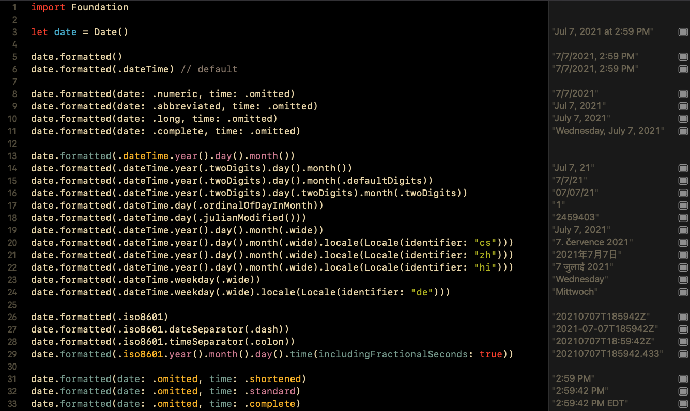

# Swift 5.5 Formatters

A playground to explore capabilities of the new formatting instance methods on Date and a project to test performance of old and new on device.



## Initial findings

From the data below recorded on an iPhone 12 Pro Max running iOS 15 beta 2 running the app in release, the baseline recorded the time for looping the given number of times (100000) with no operation. Making represents the time to initialize a DateFormatter (or ISO8601DateFormatter), Make&use represents the worst-case scenario of making a new DateFormatter at the point of use and discarding.

In the iOS 15 formatted section are the use performance metrics of a few formatted Date instance methods. After that are metrics for the use of DateFormatters that are cached and reused.

See `ContentView.swift` for the code that generates this output.

```
makeFormatterWithString() -> 2021-07-13T17:55:38-0400
makeFormatterWithDateTimeStyles() -> 7/13/21, 5:55 PM
makeISO8601Formatter() -> 2021-07-13T21:55:38Z
makeISO8601FormatterExtra() -> 2021-07-13T21:55:38.306Z
format() -> 7/13/2021, 5:55 PM
format2() -> Jul 13, 2021, 5:55:38 PM
format3() -> 7/13/21, 5:55 PM
formatISO() -> 2021-07-13T21:55:38.306Z

Baseline                                100000x:   0.000µs each    0.000ms total
Baseline                                100000x:   0.000µs each    0.000ms total
Baseline                                100000x:   0.000µs each    0.001ms total
Making Date                             100000x:   0.071µs each    7.097ms total
Making Date                             100000x:   0.080µs each    7.957ms total
Making Date                             100000x:   0.061µs each    6.086ms total
Making DF with string format            100000x:   0.428µs each   42.841ms total
Making DF with string format            100000x:   0.276µs each   27.616ms total
Making DF with string format            100000x:   0.283µs each   28.286ms total
Making DF with date/time styles         100000x:   0.302µs each   30.241ms total
Making DF with date/time styles         100000x:   0.312µs each   31.248ms total
Making DF with date/time styles         100000x:   0.300µs each   30.028ms total
Making ISO8601DateFormatters - plain      1000x:  58.333µs each   58.333ms total
Making ISO8601DateFormatters - plain      1000x:  58.566µs each   58.566ms total
Making ISO8601DateFormatters - plain      1000x:  58.955µs each   58.955ms total
Making ISO8601DateFormatters - extra      1000x: 116.212µs each  116.212ms total
Making ISO8601DateFormatters - extra      1000x: 118.301µs each  118.301ms total
Making ISO8601DateFormatters - extra      1000x: 115.477µs each  115.477ms total
Make&use DateFormatter - string frmt      1000x:  84.282µs each   84.282ms total
Make&use DateFormatter - string frmt      1000x:  84.143µs each   84.143ms total
Make&use DateFormatter - string frmt      1000x:  83.961µs each   83.961ms total
Make&use DateFormatter - styles           1000x:  88.351µs each   88.351ms total
Make&use DateFormatter - styles           1000x:  88.689µs each   88.689ms total
Make&use DateFormatter - styles           1000x:  88.441µs each   88.441ms total
Make&use ISO8601DateFormatter             1000x: 130.707µs each  130.707ms total
Make&use ISO8601DateFormatter             1000x: 130.665µs each  130.665ms total
Make&use ISO8601DateFormatter             1000x: 130.605µs each  130.605ms total
Make&use ISO8601DateFormatter extra       1000x: 203.290µs each  203.290ms total
Make&use ISO8601DateFormatter extra       1000x: 203.560µs each  203.560ms total
Make&use ISO8601DateFormatter extra       1000x: 204.076µs each  204.076ms total
- Cached DateFormatter
Use ISO8601DateFormatter extra          100000x:   1.987µs each  198.657ms total
Use ISO8601DateFormatter extra          100000x:   1.991µs each  199.072ms total
Use ISO8601DateFormatter extra          100000x:   1.987µs each  198.741ms total
Use DateFormatter - withString          100000x:   1.993µs each  199.298ms total
Use DateFormatter - withString          100000x:   1.998µs each  199.770ms total
Use DateFormatter - withString          100000x:   2.005µs each  200.518ms total
- iOS 15 formatters
Formatting date                         100000x:   3.436µs each  343.616ms total
Formatting date                         100000x:   3.427µs each  342.688ms total
Formatting date                         100000x:   3.442µs each  344.156ms total
date: .abbrev, time: .standard          100000x:   3.528µs each  352.808ms total
date: .abbrev, time: .standard          100000x:   3.545µs each  354.473ms total
date: .abbrev, time: .standard          100000x:   3.538µs each  353.783ms total
formatted = DF with date/time styles    100000x:   3.804µs each  380.369ms total
formatted = DF with date/time styles    100000x:   3.804µs each  380.406ms total
formatted = DF with date/time styles    100000x:   3.804µs each  380.389ms total
.iso8601 with fractional seconds        100000x:   3.470µs each  347.049ms total
.iso8601 with fractional seconds        100000x:   3.557µs each  355.700ms total
.iso8601 with fractional seconds        100000x:   3.495µs each  349.503ms total
- Manual tons of code
Make&Use DateFormatter - string format     100x:  90.370µs each    9.037ms total
Make DateFormatter - string format         100x:   0.310µs each    0.031ms total
Cached DateFormatter - string format       100x:   3.270µs each    0.327ms total
Cached DF not Date() - string format       100x:   3.140µs each    0.314ms total
```

